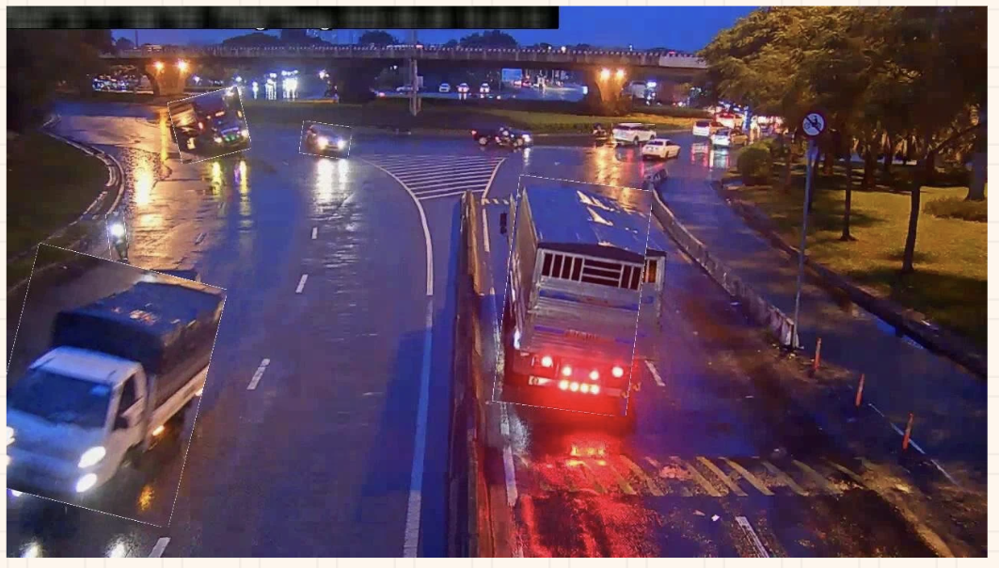
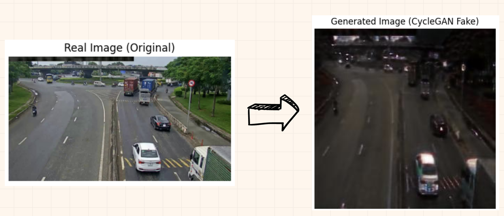
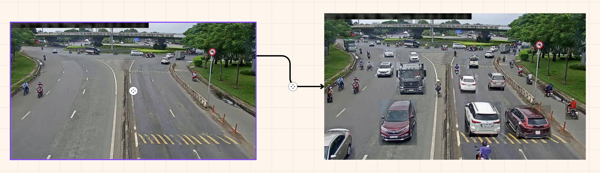
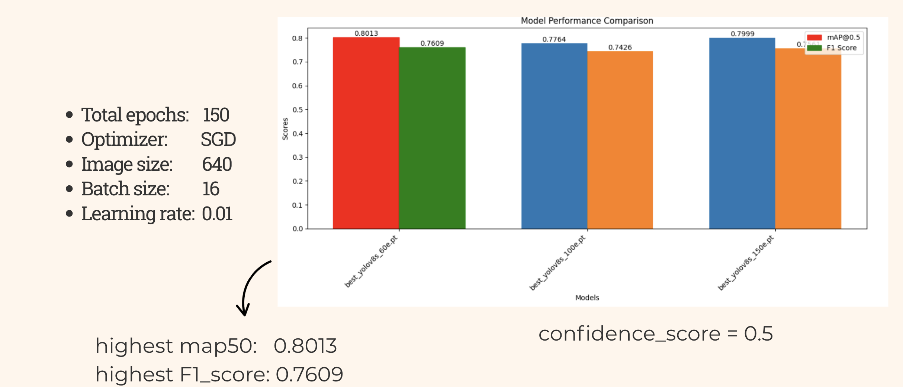
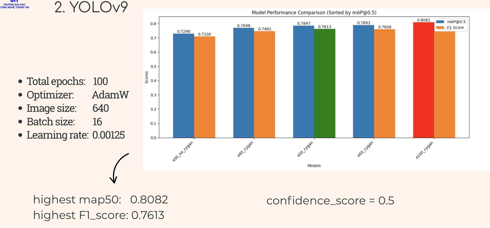
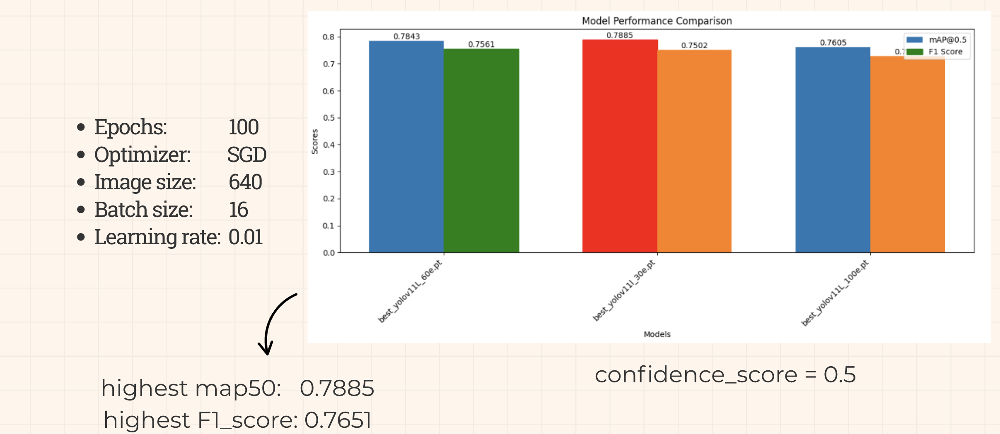
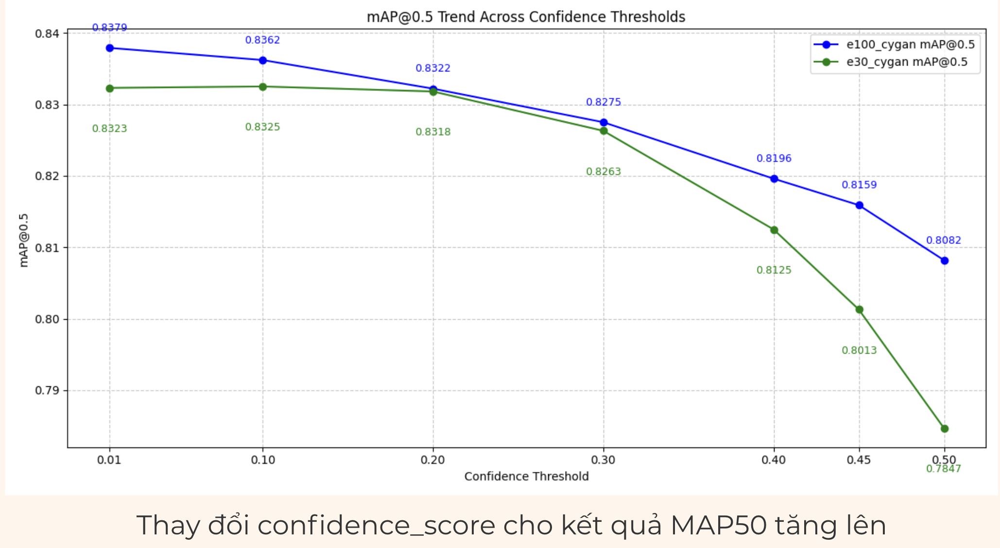
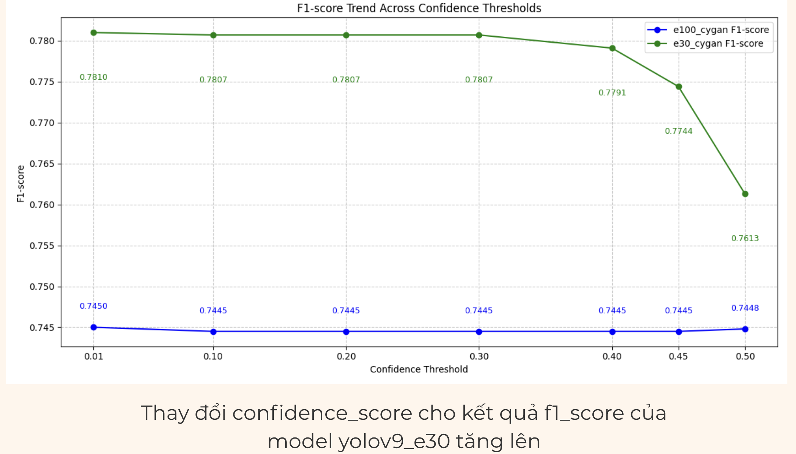

  

<h1 align="center"><b>CS331.P22 - THỊ GIÁC MÁY TÍNH NÂNG CAO</b></h1>

## COURSE INTRODUCTION
* **Course Title**: Thị giác máy tính nâng cao  
* **Course Code**: CS331.P22  
* **Year**: 2024–2025  

## ACADEMIC ADVISOR
* **Lê Minh Hưng**

## MEMBERS
* Ngô Thành Trung — 22521560  
* Nguyễn Minh Thiện — 22521391  

---

# 🚗 Vehicle Detection Using YOLO Models  
In this project, we perform an empirical study on the **vehicle detection** task using multiple YOLO architectures, with a primary focus on **YOLOv9**.  
The detection task includes **4 vehicle labels**:

- *Xe máy*  
- *Xe vận tải du lịch (xe khách)*  
- *Xe vận tải container*  
- *Xe ô tô con*  

Our goal is to analyze model behavior under different training strategies, augmentations, confidence thresholds, and prediction fusion methods.

---

## 1️⃣ Removal of White Boxes  
Brief overview of how we processed images to eliminate unwanted white lines around vehicles within the image. We use Erosion from OpenCV library (cv2.erode()), to remove white box

  

<i>Unwanted white box around vehicle</i>

---

## 2️⃣ Night Image Augmentation (CycleGAN)  
The number of daytime and nighttime images are 5513 and 3703 respectively, therefor, we perform an augmentation for the nighttime images. We use CycleGAN, to generate from daytime images into "fake" nighttime images. Around 2000 "fake images" were created.

  

<i>Example of image created using CycleGAN</i>

---
## 3️⃣ Increasing Number of Vehicles Within Images  
When inspecting the dataset, we observed that many images contained only a small number of vehicles (some as few as 10). Therefore, we perform a **“vehicle count augmentation”** procedure (copy-n-paste augmentation) with the following steps:

1. Group images that belong to the same camera angle.  
2. Iterate through images and copy vehicle objects from other images within the same group, keeping their original bounding box positions.  
3. Paste the copied objects into the corresponding positions of the current image.  
4. Add the new bounding boxes to the annotation file.

  

<i>Example of copy-n-paste augmentation</i>

After this procedure, the average number of vehicles per image increased.

  

<i>Vehicle Statistics Comparision between copy-n-paste augmentation and original images.</i>

---

## 4️⃣ Experiments with YOLOv8, YOLOv9, and YOLOv11  
Summary: comparative experiments performed using three YOLO versions: YOLOv8, YOLOv11 and YOLOv9. All trained models were evaluate using MAP@50. We chose YOLOv9 with full augmentation as our final models.

  

<i>YOLOv8 stats</i>

  

<i>YOLOv9 stats</i>

  

<i>YOLOv11 stats</i>

---

## 6️⃣ Confidence Threshold Experiments  
We further perform analysis on how different confidence thresholds affect precision/recall and mAP performance. The lower the confidence score of the models, the higher the MAP50 we achived, whereas the F1-score remains nearly unchanged.

  

<i>Changes in MAP50 base on confidence score</i>

  

<i>Changes in F1-score base on confidence threshold</i>

---

## 📘 Additional Resources

### 🔍 Detailed Analysis
For full experiments, visualizations, metrics, and implementation details, please see our Kaggle Notebook:  
👉 **[Kaggle Notebook Link Here](https://www.kaggle.com/code/ictunivers/yolo9/notebook)**

### 🎤 Presentation Slides
Our project presentation is available here:  
👉 **[Presentation Link Here](https://www.canva.com/design/DAGpHjpfPao/eKJuuc4YhpQERZDGl0_J4A/edit?utm_content=DAGpHjpfPao&utm_campaign=designshare&utm_medium=link2&utm_source=sharebutton)**

